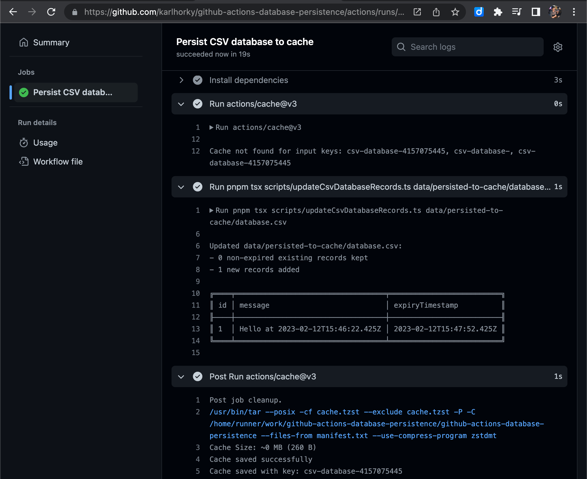
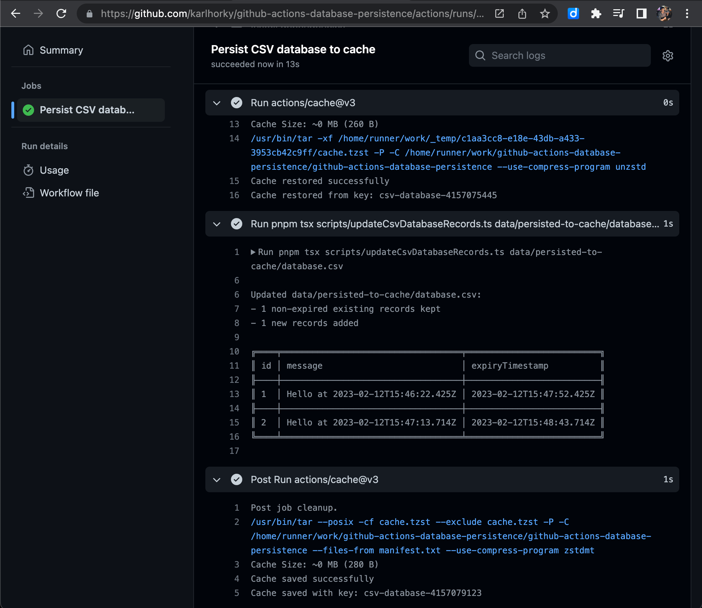

# GitHub Actions Database Persistence

> GitHub Actions CRON workflow experiments with persisting CSV, SQLite and PostgreSQL databases to GitHub Actions cache and Git commits

## Approach

### Persistence to GitHub Actions cache

Use [`actions/cache`](https://github.com/actions/cache) to store a database on ephemeral GitHub cloud storage for short-lived, non-critical data

Caveats (from [Usage limits and eviction policy](https://docs.github.com/en/actions/using-workflows/caching-dependencies-to-speed-up-workflows#usage-limits-and-eviction-policy) and [the GitHub Actions cache warnings](https://docs.github.com/en/actions/using-workflows/caching-dependencies-to-speed-up-workflows#usage-limits-and-eviction-policy:~:text=Warning%3A%20Be%20mindful%20of%20the%20following%20when%20using%20caching%20with%20GitHub%20Actions)):

- Caches that have not been accessed in 7 days will be removed
- The total size of all caches in a repository is limited to 10GB
- Don't store any sensitive information (eg. access tokens or login credentials) in the cache - anyone with read access can create a pull request on a repository to access the contents of a cache
- Caches from workflow runs are stored on GitHub-owned cloud storage

## Experiments

### Persist CSV Database to GitHub Actions Cache

Saves a CSV database to [GitHub Actions Cache](#persistence-to-github-actions-cache)

- [GitHub Actions Workflow](https://github.com/karlhorky/github-actions-database-persistence/blob/main/.github/workflows/persist-csv-database-to-cache.yml)
- [Script](https://github.com/karlhorky/github-actions-database-persistence/blob/main/scripts/createCsvDatabaseRecords.ts)

### Example

The first run, which saved a first message record to the CSV database file and saved this to the GitHub Actions cache:

<figure>
  
  <figcaption><em>A screenshot of the GitHub Actions interface, showing a first run of the workflow, where the cache is not yet found. Running the script shows only the single new record in the CSV database.</em></figcaption>
</figure>

The second run, restoring the existing records from the CSV file in the cache and adding a second record:

<figure>
  
  <figcaption><em>A screenshot of the GitHub Actions interface, showing a second run of the workflow, where the cache is now found and restored successfully. Running the script shows both the existing record from the first run and the new record which has been added.</em></figcaption>
</figure>
