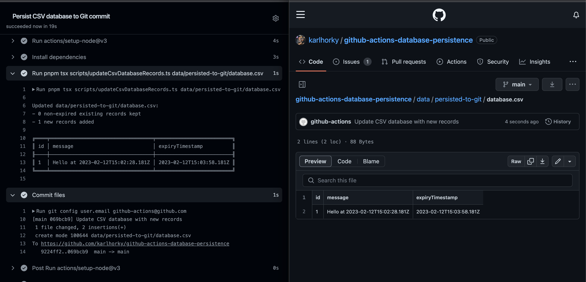
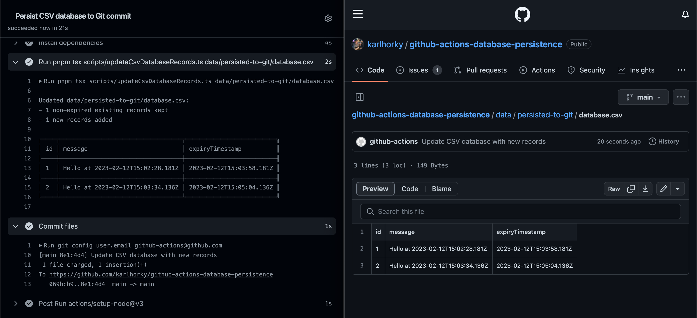

# GitHub Actions Database Persistence

> GitHub Actions CRON workflow experiments with persisting CSV, SQLite and PostgreSQL databases to GitHub Actions cache and Git commits

## Approach

### Persistence to GitHub Actions cache

Use [`actions/cache`](https://github.com/actions/cache) to store a database on ephemeral GitHub cloud storage for short-lived, non-critical data

Caveats (from [Usage limits and eviction policy](https://docs.github.com/en/actions/using-workflows/caching-dependencies-to-speed-up-workflows#usage-limits-and-eviction-policy) and [the GitHub Actions cache warnings](https://docs.github.com/en/actions/using-workflows/caching-dependencies-to-speed-up-workflows#usage-limits-and-eviction-policy:~:text=Warning%3A%20Be%20mindful%20of%20the%20following%20when%20using%20caching%20with%20GitHub%20Actions)):

- Caches that have not been accessed in 7 days will be removed
- The total size of all caches in a repository is limited to 10GB
- Don't store any sensitive information (eg. access tokens or login credentials) in the cache - anyone with read access can create a pull request on a repository to access the contents of a cache
- Caches from workflow runs are stored on GitHub-owned cloud storage

### Persistence to Git commits on GitHub

Use GitHub repository storage to store a database for smaller, longer-lived data

Caveats (from [About large files on GitHub](https://docs.github.com/en/repositories/working-with-files/managing-large-files/about-large-files-on-github))

- GitHub blocks files larger than 100MB
- GitHub strongly recommends repositories smaller than 5GB

## Experiments

### Persist CSV Database to GitHub Actions Cache

Saves a CSV database to [GitHub Actions Cache](#persistence-to-github-actions-cache)

- [GitHub Actions Workflow](https://github.com/karlhorky/github-actions-database-persistence/blob/main/.github/workflows/persist-csv-database-to-cache.yml)
- [Script](https://github.com/karlhorky/github-actions-database-persistence/blob/main/scripts/updateCsvDatabaseRecords.ts)

### Example

Run 1:

1. Does not find a cache
2. Creates the CSV database file and adds a first message record
3. Saves the file to the GitHub Actions cache

<figure>
  
  <figcaption>
<em>A screenshot of run 1 in the GitHub Actions interface</em>
</figcaption>
</figure>

 
 

Run 2:

1. Finds a cache with the CSV database file
2. Adds a new record to the existing records
3. Saves the file to the GitHub Actions cache

<figure>
  
  <figcaption>
<em>A screenshot of run 2 in the GitHub Actions interface</em>
</figcaption>
</figure>

 
 

Run 3:

1. Finds a cache with the CSV database file
2. Removes expired records
3. Adds a new record to the existing records
4. Saves the file to the GitHub Actions cache

<figure>
  
  <figcaption>
<em>A screenshot of run 3 in the GitHub Actions interface</em>
</figcaption>
</figure>

### Persist CSV Database to Git commits on GitHub

Saves a CSV database to [Git commits on GitHub](#persistence-to-git-commits-on-github)

- [GitHub Actions Workflow](https://github.com/karlhorky/github-actions-database-persistence/blob/main/.github/workflows/persist-csv-database-to-git.yml)
- [Script](https://github.com/karlhorky/github-actions-database-persistence/blob/main/scripts/updateCsvDatabaseRecords.ts)

### Example

Run 1:

1. Creates a CSV database file since no file exists
2. Adds a new record
3. Saves the file to a new Git commit on GitHub

<figure>
  
  <figcaption>
<em>A screenshot of run 1 in the GitHub Actions interface and the resulting committed file</em>
</figcaption>
</figure>

 
 

Run 2:

1. Adds a new record to the existing records
2. Saves the file to a new Git commit on GitHub

<figure>
  
  <figcaption>
<em>A screenshot of run 2 in the GitHub Actions interface and the resulting committed file</em>
</figcaption>
</figure>

 
 

Run 3:

1. Removes expired records
2. Adds a new record to the existing records
3. Saves the file to a new Git commit on GitHub

<figure>
  
  <figcaption>
<em>A screenshot of run 3 in the GitHub Actions interface and the resulting committed file</em>
</figcaption>
</figure>

### Persist SQLite Database to GitHub Actions Cache

TODO

### Persist SQLite Database to Git commits on GitHub

TODO

### Persist PostgreSQL Database to GitHub Actions Cache

TODO

### Persist PostgreSQL Database to Git commits on GitHub

TODO
